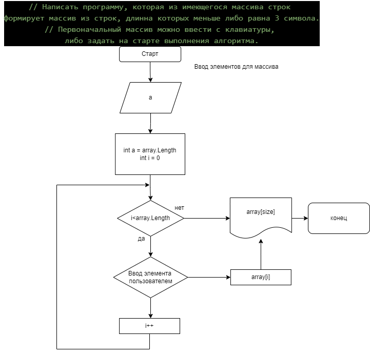
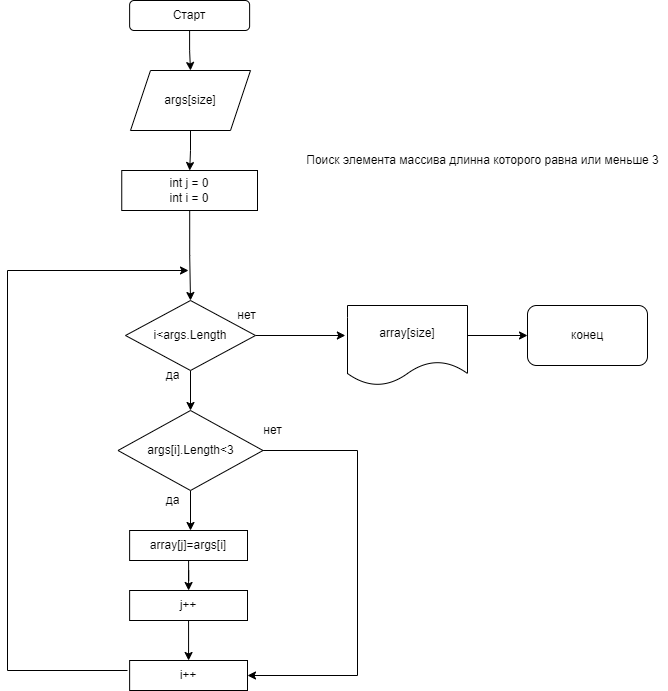

# Итоговая проверочная работа

## Содержание работы

1. Создание репозитория.
2. Блок схема.
3. Текастовое описание.
4. Программа по заданию.
5. Контроль версий.

## Текстовое описание

+ Репозиторий создан на сайте Githab, через вкладку "Новый репозиторий" с добавлением при создании файла "README.md.
+ Добавлен файл "gitignore", сделан коммит и произведена синхронизация с файлом на Githab.
+ Текстовая часть задания ведется в основной ветке.
+ Созданы дополнительные ветки "branch".
+ В ветке номер 1 написана программа по нахождению элемента длинной не более 3 символов.
+ В ветке номер 2 добавлена блок схема.
+ Произведено слияние данных веток с основной веткой.

## Алгоритм

+ Создаем запрос на количество элементов в масииве.
+ Создаем метод для ввода элементов в массив. Так как элементы могут быть числовыми и текстовыми, функция будет "string". Элементы вводятся последовательно.
+ Создаем метод для проверки длинны элементов массива на меньше или равно 3 символам. Путем цикла "for".
+ Сделана проверка на try catch, на ввод данных минусового значения, или значения больше 10 символов.

## Блок схема

_Блок схема №1_

_Блок схема №2_

